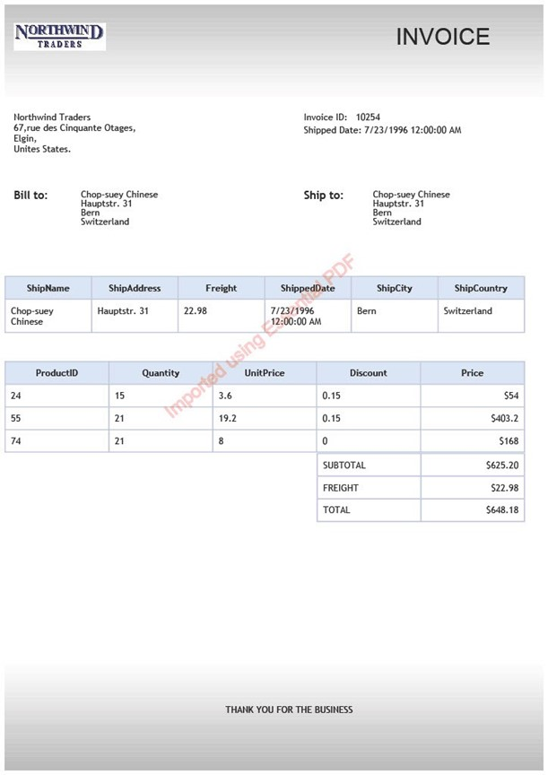
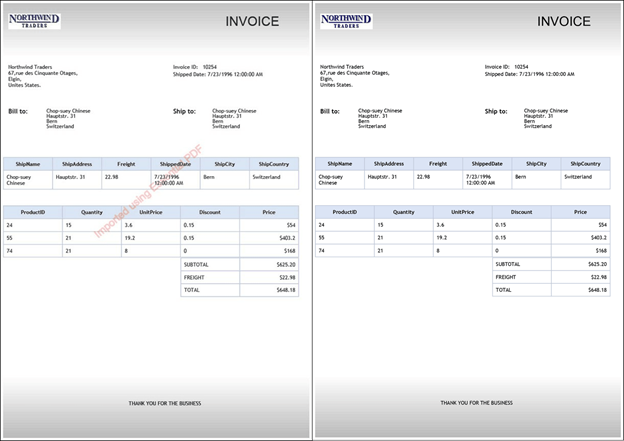

# Add watermark to PDF using C#

The [Syncfusion .NET PDF Library](https://www.syncfusion.com/document-processing/pdf-framework/net/pdf-library) provides support to add watermark as an image or text that is added to a PDF document to indicate the authenticity or ownership of the document. The library provides APIs for programmatically adding watermarks to PDF documents, with options for specifying the position, size, and opacity of the watermark.

Name | Description
--- | ---
[Text watermark](https://github.com/SyncfusionExamples/add-watermark-to-pdf-csharp/tree/master/Text_Watermark_PDF) |  It a practical technique for maintaining document security, intellectual property protection, and branding initiatives.
[Image watermark](https://github.com/SyncfusionExamples/add-watermark-to-pdf-csharp/tree/master/Image_Watermark_PDF) |  It can be a useful tool for protecting your intellectual property, establishing your brand identity, adding security features to your documents, and indicating confidentiality. 
[Remove watermark](https://github.com/SyncfusionExamples/add-watermark-to-pdf-csharp/tree/master/Remove_Watermark_PDF) | It can be useful in cases where the watermark is no longer needed, or when the PDF file needs to be shared without the watermark. 

## Add text watermark to a PDF using C#  
Text watermarks are a practical technique for maintaining document security, intellectual property protection, and branding initiatives. Yet, it can act as a deterrent and aid in identifying the document's owner or origin. 

The following code example shows how to create text watermark in PDF document using C#. 

```csharp
//Load the PDF document 
PdfLoadedDocument loadedDocument = new PdfLoadedDocument(inputStream); 
//Get the page  
PdfLoadedPage lpage = loadedDocument.Pages[0] as PdfLoadedPage; 

//Creates PDF watermark annotation  
PdfWatermarkAnnotation watermark = new PdfWatermarkAnnotation(new RectangleF(100, 300, 400, 400)); 
//Sets properties to the annotation  
watermark.Opacity = 0.5f; 
//Create the appearance of watermark  
watermark.Appearance.Normal.Graphics.DrawString("Imported using Essential PDF", new PdfStandardFont(PdfFontFamily.Helvetica, 20), PdfBrushes.Red, new RectangleF(50, 50, 250, 50), new PdfStringFormat(PdfTextAlignment.Center, PdfVerticalAlignment.Middle)); 
//Adds the annotation to page  
lpage.Annotations.Add(watermark); 

FileStream stream = new FileStream("Output.pdf", FileMode.Create); 
//Save the modified document to file. 
loadedDocument.Save(stream); 
//Close the PDF document. 
loadedDocument.Close(true); 
stream.Close(); 
```
Execute this code example to get a text watermark in PDF document like in the following screenshot. 
 


## Add image watermark to a PDF using C# 

Image watermarks can be a useful tool for protecting your intellectual property, establishing your brand identity, adding security features to your documents, and indicating confidentiality. 

The following code example shows how to create an image watermark in PDF document using C#. 

```csharp
//Load the PDF document 
PdfLoadedDocument loadedDocument = new PdfLoadedDocument(docStream); 
//Get the page  
PdfLoadedPage lpage = loadedDocument.Pages[0] as PdfLoadedPage; 

//Creates PDF watermark annotation  
PdfWatermarkAnnotation watermark = new PdfWatermarkAnnotation(new RectangleF(100, 300, 400, 400)); 
//Sets properties to the annotation  
watermark.Opacity = 0.5f; 
//Create the appearance of watermark  
FileStream imageStream = new FileStream("Image.jpg", FileMode.Open, FileAccess.Read); 
PdfImage image = new PdfBitmap(imageStream); 
watermark.Appearance.Normal.Graphics.DrawImage(image, new PointF(0, 0)); 
//Adds the annotation to page  
lpage.Annotations.Add(watermark); 

FileStream stream = new FileStream("output.pdf", FileMode.Create); 
//Save the modified document to file. 
loadedDocument.Save(stream); 
//Close the PDF document. 
loadedDocument.Close(true); 
stream.Close(); 
```
Execute this code example to get an image watermark in PDF document like in the following screenshot. 


## Remove watermark from a PDF using C#

Removing a watermark from a PDF document can be useful in cases where the watermark is no longer needed, or when the PDF file needs to be shared without the watermark. 

The following code example shows how to remove a watermark in PDF document using C#. 

```csharp
//Load the PDF document 
PdfLoadedDocument loadedDocument = new PdfLoadedDocument(docStream); 
for (int i = 0; i < loadedDocument.Pages.Count; i++) 
{ 
//Get the page  
PdfLoadedPage lpage = loadedDocument.Pages[i] as PdfLoadedPage; 
//Gets the annotation collection 
PdfLoadedAnnotationCollection annotations = lpage.Annotations; 
    for (int j = 0; j < annotations.Count; j++) 
    { 
        //Gets the annotation 
        PdfLoadedAnnotation annotation = lpage.Annotations[j] as PdfLoadedAnnotation; 
        if (annotation != null && annotation is PdfLoadedWatermarkAnnotation) 
        { 
            //Removes the first annotation 
            annotations.RemoveAt(j); 
        } 
    } 
}  

FileStream stream = new FileStream("output.pdf", FileMode.Create); 
//Save the modified document to file. 
loadedDocument.Save(stream); 
//Close the PDF document. 
loadedDocument.Close(true); 
stream.Close();
```
Execute this code example to get a remove watermark in PDF document like in the following screenshot. 



# How to run the examples
* Download this project to a location in your disk. 
* Open the solution file using Visual Studio. 
* Rebuild the solution to install the required NuGet package. 
* Run the application.

# Resources
*   **Product page:** [Syncfusion PDF Framework](https://www.syncfusion.com/document-processing/pdf-framework/net)
*   **Documentation page:** [Syncfusion .NET PDF library](https://help.syncfusion.com/file-formats/pdf/overview)
*   **Online demo:** [Syncfusion .NET PDF library - Online demos](https://ej2.syncfusion.com/aspnetcore/PDF/CompressExistingPDF#/bootstrap5)
*   **Blog:** [Syncfusion .NET PDF library - Blog](https://www.syncfusion.com/blogs/category/pdf)
*   **Knowledge Base:** [Syncfusion .NET PDF library - Knowledge Base](https://www.syncfusion.com/kb/windowsforms/pdf)
*   **EBooks:** [Syncfusion .NET PDF library - EBooks](https://www.syncfusion.com/succinctly-free-ebooks)
*   **FAQ:** [Syncfusion .NET PDF library - FAQ](https://www.syncfusion.com/faq/)

# Support and feedback
*   For any other queries, reach our [Syncfusion support team](https://www.syncfusion.com/support/directtrac/incidents/newincident?utm_source=github&utm_medium=listing&utm_campaign=github-docio-examples) or post the queries through the [community forums](https://www.syncfusion.com/forums?utm_source=github&utm_medium=listing&utm_campaign=github-docio-examples).
*   Request new feature through [Syncfusion feedback portal](https://www.syncfusion.com/feedback?utm_source=github&utm_medium=listing&utm_campaign=github-docio-examples).

# License
This is a commercial product and requires a paid license for possession or use. Syncfusion’s licensed software, including this component, is subject to the terms and conditions of [Syncfusion's EULA](https://www.syncfusion.com/eula/es/?utm_source=github&utm_medium=listing&utm_campaign=github-docio-examples). You can purchase a licnense [here](https://www.syncfusion.com/sales/products?utm_source=github&utm_medium=listing&utm_campaign=github-docio-examples) or start a free 30-day trial [here](https://www.syncfusion.com/account/manage-trials/start-trials?utm_source=github&utm_medium=listing&utm_campaign=github-docio-examples).

# About Syncfusion
Founded in 2001 and headquartered in Research Triangle Park, N.C., Syncfusion has more than 26,000+ customers and more than 1 million users, including large financial institutions, Fortune 500 companies, and global IT consultancies.

Today, we provide 1600+ components and frameworks for web ([Blazor](https://www.syncfusion.com/blazor-components?utm_source=github&utm_medium=listing&utm_campaign=github-docio-examples), [ASP.NET Core](https://www.syncfusion.com/aspnet-core-ui-controls?utm_source=github&utm_medium=listing&utm_campaign=github-docio-examples), [ASP.NET MVC](https://www.syncfusion.com/aspnet-mvc-ui-controls?utm_source=github&utm_medium=listing&utm_campaign=github-docio-examples), [ASP.NET WebForms](https://www.syncfusion.com/jquery/aspnet-webforms-ui-controls?utm_source=github&utm_medium=listing&utm_campaign=github-docio-examples), [JavaScript](https://www.syncfusion.com/javascript-ui-controls?utm_source=github&utm_medium=listing&utm_campaign=github-docio-examples), [Angular](https://www.syncfusion.com/angular-ui-components?utm_source=github&utm_medium=listing&utm_campaign=github-docio-examples), [React](https://www.syncfusion.com/react-ui-components?utm_source=github&utm_medium=listing&utm_campaign=github-docio-examples), [Vue](https://www.syncfusion.com/vue-ui-components?utm_source=github&utm_medium=listing&utm_campaign=github-docio-examples), and [Flutter](https://www.syncfusion.com/flutter-widgets?utm_source=github&utm_medium=listing&utm_campaign=github-docio-examples)), mobile ([Xamarin](https://www.syncfusion.com/xamarin-ui-controls?utm_source=github&utm_medium=listing&utm_campaign=github-docio-examples), [Flutter](https://www.syncfusion.com/flutter-widgets?utm_source=github&utm_medium=listing&utm_campaign=github-docio-examples), [UWP](https://www.syncfusion.com/uwp-ui-controls?utm_source=github&utm_medium=listing&utm_campaign=github-docio-examples), and [JavaScript](https://www.syncfusion.com/javascript-ui-controls?utm_source=github&utm_medium=listing&utm_campaign=github-docio-examples)), and desktop development ([WinForms](https://www.syncfusion.com/winforms-ui-controls?utm_source=github&utm_medium=listing&utm_campaign=github-docio-examples), [WPF](https://www.syncfusion.com/wpf-ui-controls?utm_source=github&utm_medium=listing&utm_campaign=github-docio-examples), [WinUI(Preview)](https://www.syncfusion.com/winui-controls?utm_source=github&utm_medium=listing&utm_campaign=github-docio-examples), [Flutter](https://www.syncfusion.com/flutter-widgets?utm_source=github&utm_medium=listing&utm_campaign=github-docio-examples) and [UWP](https://www.syncfusion.com/uwp-ui-controls?utm_source=github&utm_medium=listing&utm_campaign=github-docio-examples)). We provide ready-to-deploy enterprise software for dashboards, reports, data integration, and big data processing. Many customers have saved millions in licensing fees by deploying our software.
